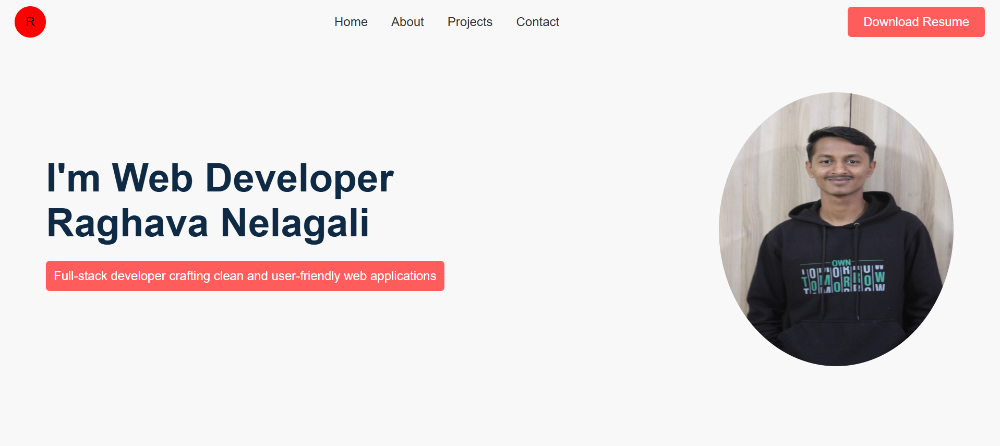
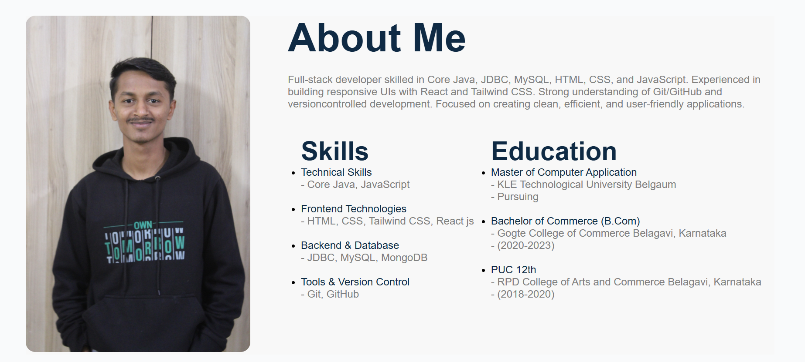
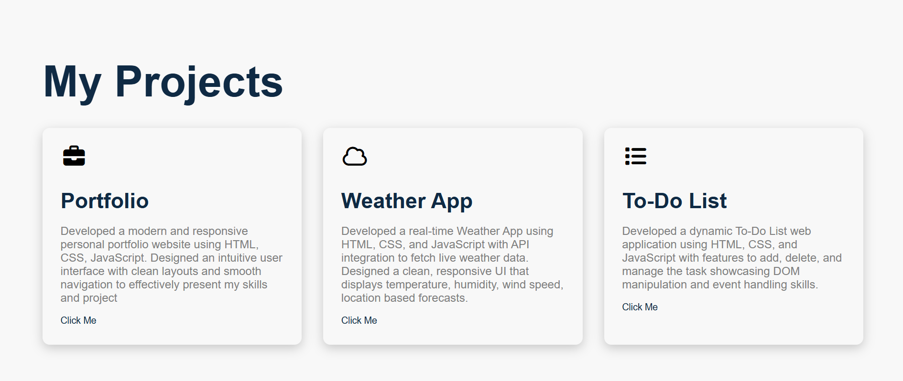

# 🌐 Personal Portfolio Website

## 🚀 About
This is my personal portfolio website created to showcase my skills, projects, and background as a developer. It highlights my work, technical abilities, and provides a way to connect with me.

---

## 🛠️ Technologies Used
- HTML  
- CSS  

---

## ✨ Features
1. Responsive and clean UI design  
2. Home section with introduction  
3. About section with skills and education  
4. Projects section to showcase my work  

---

## 📂 Project Structure
portfolio/
│
├── index.html    
├── style.css  

---

## 📸 Screenshots
### 🏠 Home Page

### 👤 About Page

### 📂 Projects Page

---

## 📌 Author
**Raghavendra Nelagali**

---

## 📬 Contact
- Email: raghunelagali121@gmail.com  
- LinkedIn: 

---

## ⭐ Note
This project is continuously being improved with new features and better design.